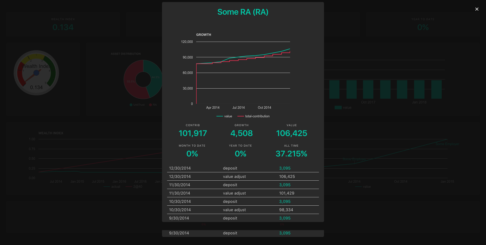

# Bucks #

Bucks is a command line tool used to track various financial health indicators like

1. Wealth Index
2. Yearly Goals
3. Tax Free Saving Limits
4. Asset Performance

# How to Run #

With Clojure => `lein run`

With Java => java -j bucks.jar

# How to Use #

Bucks uses a command line interface. Once running you can:

Type `help` to see a list of available actions

For any action you can type `action-name -h` to see a list of parameters ex. `salary -h`.

### Data ###

Add your monthly salary changes and some assets to start seeing data.

Capture any deposits or withdrawals against assets (including the assets value after the transaction).

Update your asset values once a month or so (using `value` function).

Add some yearly and wealth index goals to track performance.

### Report ###

To view the report type `report`. This will open your browser (only tested in chrome). You will see some warnings if data is missing.

Drag charts to zoom and right click to reset.

