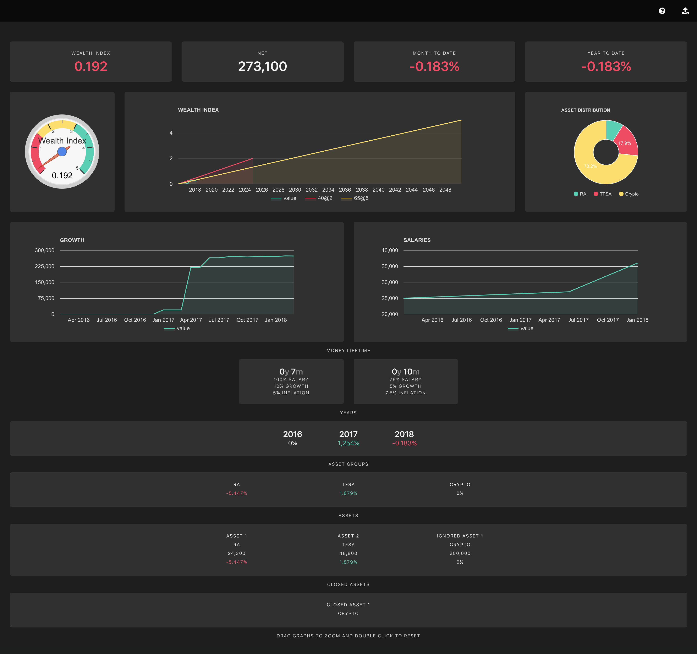

# Bucks #

Bucks is a clojurescript app that gives financial insights based on input from a csv file.

To run, Start figwheel in your repl of choice.

see example.cljs for an example of a pipe delimited csv file.

